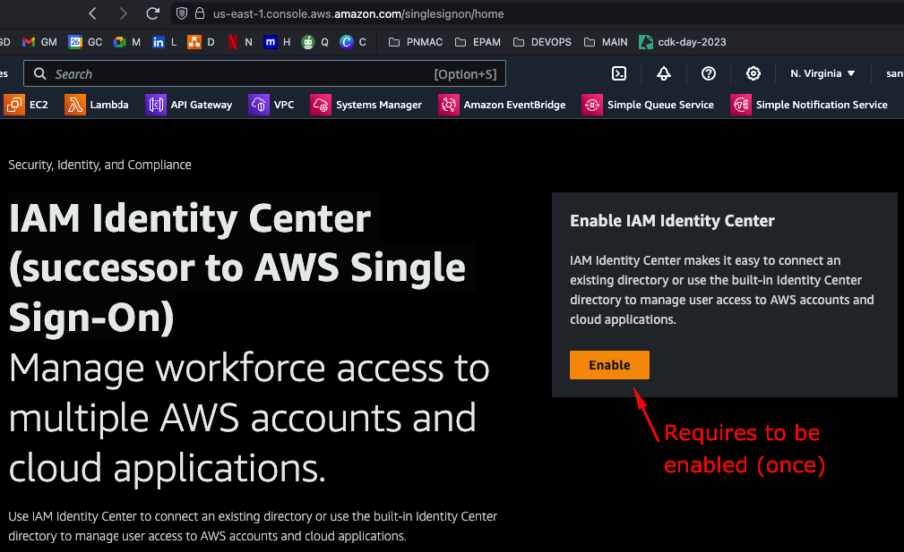
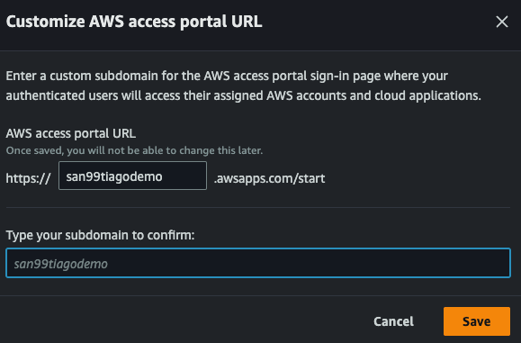

[](https://github.com/san99tiago/aws-cdk-organizations-demo/blob/main/LICENSE)
[](https://github.com/san99tiago/aws-cdk-organizations-demo/actions/workflows/deploy.yml)
[](https://github.com/san99tiago/aws-cdk-organizations-demo/releases)

# [](https://github.com/san99tiago/aws-cdk-organizations-demo) AWS-CDK-ORGANIZATIONS-DEMO [](https://github.com/san99tiago/aws-cdk-organizations-demo)

Advanced DEMO of [AWS Organizations](https://aws.amazon.com/organizations/) for sharing the best practices of managing multiple production-grade AWS Accounts with Infrastructure as Code on [CDK-Python](https://docs.aws.amazon.com/cdk/v2/guide/home.html).

## Architecture 🏦

This diagram illustrates the generated AWS Organizations structure with multiple OUs and Account.

 <br>

```bash
# Hierarchy of the OUs and Accounts
OURoot/
├── 🏠ManagementAccount(🚩)
├── 📝OUInfrastructure/
│   ├── 📝OUInfrastructureNonProd/
│   │   └── 🏠AccountSharedServicesNonProd
│   └── 📝OUInfrastructureProd/
│       └── 🏠AccountSharedServicesProd
├── 📝OUWorkloads/
│   ├── 📝OUFinance/
│   │   ├── 📝OUFinanceNonProd/
│   │   │   ├── 🏠AccountFinanceDev
│   │   │   └── 🏠AccountFinanceQA
│   │   └── 📝OUFinanceProd/
│   │       └── 🏠AccountFinanceProd
│   └── 📝OUMarketing/
│       ├── 📝OUMarketingNonProd/
│       │   ├── 🏠AccountMarketingDev
│       └── 📝OUMarketingProd/
│           └── 🏠AccountMarketingProd
└── 📝OUPolicyStagingTests/
    └── 🏠AccountPolicyStagingTests
```

## CI/CD and Deployment 🚀

The deployment process is intended to run with GitHub Actions Workflows and implementing the Cloud Development Tool (CDK) tool for managing the IaC and State.

 <br>

- On `feature/****` branches commits, the CDK project gets **synthesized** and it shows the **state diff** between the current AWS resources and the expected ones.

- When merged to `main` branch, it will get deployed to the AWS Account automatically.

To understand the AWS Credentials usage for GitHub Actions auth, please refer to the [`prerequisites/README.md`](.github/prerequisites/README.md).

## Manual Steps (Only Once) 👋

As of now, IAM Identity Center (successor to AWS Single Sign-On) has to be "manually" enabled once, so that the SSO Configurations and Permission Sets can be created via IaC. In order to do so, we have to go to the SSO Console and click on `Enable IAM Identity Center`:

 <br>

Then, we have to configure our SSO URL as follows:

 <br>

## Special thanks 🎁

- Huge shout-out to [pepperize/cdk-organizations](https://github.com/pepperize/cdk-organizations) for the Custom AWS-CDK Constructs that are provided for managing this project.

## Author 🎹

### Santiago Garcia Arango

<table border="1">
    <tr>
        <td>
            <p align="center">Curious DevOps Engineer passionate about advanced cloud-based solutions and deployments in AWS. I am convinced that today's greatest challenges must be solved by people that love what they do.</p>
        </td>
        <td>
            <p align="center"></p>
        </td>
    </tr>
</table>

## LICENSE

Copyright 2023 Santiago Garcia Arango.
