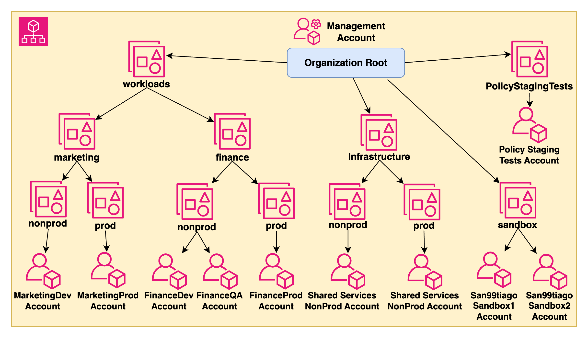

# 🅾️ AWS-CDK-ORGANIZATIONS-DEMO 🅾️


Advanced DEMO of AWS Organization for sharing the best practices of managing multiple production-grade AWS Accounts with Infrastructure as Code on [CDK-Python](https://docs.aws.amazon.com/cdk/v2/guide/home.html).

## Architecture 🏦

This diagram illustrates the generated AWS Organizations structure with multiple OUs and Account.

 <br>

```bash
# Hierarchy of the OUs and Accounts
OURoot/
├── 🏠ManagementAccount(🚩)
├── 📝OUInfrastructure/
│   ├── 📝OUInfrastructureNonProd/
│   │   └── 🏠AccountSharedServicesNonProd
│   └── 📝OUInfrastructureProd/
│       └── 🏠AccountSharedServicesProd
├── 📝OUWorkloads/
│   └── 📝OUFinance/
│       ├── 📝OUFinanceNonProd/
│       │   ├── 🏠AccountFinanceDev
│       │   └── 🏠AccountFinanceQA
│       └── 📝OUFinanceProd/
│           └── 🏠AccountFinanceProd
└── 📝OUPolicyStagingTests/
    └── 🏠AccountPolicyStagingTests
```

## CI/CD and Deployment 🚀

The deployment process is intended to run with GitHub Actions Workflows and implementing the Cloud Development Tool (CDK) tool for managing the IaC and State.

 <br>

- On `feature/****` branches commits, the CDK project gets **synthesized** and it shows the **state diff** between the current AWS resources and the expected ones.

- When merged to `main` branch, it will get deployed to the AWS Account automatically.

To understand the AWS Credentials usage for GitHub Actions auth, please refer to the [`prerequisites/README.md`](.github/prerequisites/README.md).

## Special thanks 🎁

- Huge shout-out to [pepperize/cdk-organizations](https://github.com/pepperize/cdk-organizations) for the Custom AWS-CDK Constructs that are provided for managing this project.

## Author 🎹

### Santiago Garcia Arango

<table border="1">
    <tr>
        <td>
            <p align="center">Curious DevOps Engineer passionate about advanced cloud-based solutions and deployments in AWS. I am convinced that today's greatest challenges must be solved by people that love what they do.</p>
        </td>
        <td>
            <p align="center"></p>
        </td>
    </tr>
</table>

## LICENSE

Copyright 2023 Santiago Garcia Arango.
